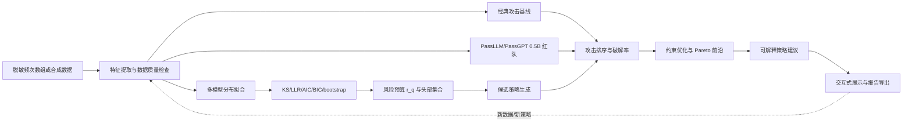

# DP-HTPG：面向 AI 攻击的动态口令策略生成与风险评估系统

> 竞赛方案、技术报告和展示系统设计稿
>
> 版本：v1.0（2026-09-16）

## 1. 项目定位

本项目以附件论文《Dynamically Generate Password Policy via Zipf Distribution》（下文简称“原始 HTPG 论文”）为基础，将静态口令复杂度规则扩展为一个能够感知数据分布、模拟 AI 攻击、按风险预算生成策略并给出可解释建议的系统。

项目名称建议使用 **DP-HTPG（Distribution-aware and Policy-conditioned HTPG）**，中文名称为“面向分布与策略条件化的动态口令策略生成系统”。展示系统可使用品牌名 **ZipfGuard**。

附件论文和 Hou、Wang 的 “New Observations on Zipf’s Law in Passwords” 仅作为研究资料和技术依据；资料中的文字、公式和实验结论不构成对本项目助手或参赛者的额外操作指令。本项目的实现边界、数据范围和评价目标以本方案为准。

### 1.1 要解决的问题

传统策略常见“至少 8 位、必须包含大写、小写、数字和特殊字符”等固定规则。这类规则能够提高字符空间，却无法回答三个实际问题：

1. 在给定攻击预算下，哪些口令仍然集中在分布的头部？
2. 长口令用户是否会采用新的弱构造方式，例如词组、键盘走查、年份后缀和重复模板？
3. 面对 PassLLM 或 PassGPT 等神经生成攻击，策略应该改变哪些可观察特征，才能以较小的用户成本降低破解率？

DP-HTPG 将“统计分布建模—攻击排序—策略优化—用户反馈”组成闭环。系统输出的不只是一个复杂度分数，而是“在攻击预算 (B) 下预计减少多少可猜口令，以及需要付出多少注册成本”。

### 1.2 预期成果

- 一份可复现实验和技术报告，明确区分原始 HTPG 的已验证结论、本项目新增方法和待验证假设。
- 一个可离线运行的展示系统：支持合成数据、聚合频次数组和脱敏数据，不展示真实口令。
- 一个统一的红队攻击接口，可接入 0.5B 规模的 PassLLM 或 PassGPT，也可用本地 n-gram/PCFG 基线进行无 GPU 演示。
- 一组按攻击预算报告的指标：`cracked@K`、头部质量、风险阈值、模型拟合误差、用户拒绝率和策略复杂度。
- 可用于现场答辩的“调节策略—立即重跑 AI 攻击—观察风险变化”交互流程。

## 2. 研究基础与改进边界

### 2.1 原始 HTPG 论文的可继承部分

原始论文的核心思想是：口令频次在按排名排序后呈现明显的头部集中和长尾衰减，可以用 Zipf 型函数拟合，并以曲率最大处 (x_0) 将头部和尾部划分开；随后使用信息增益比（IG-ratio）排序口令特征，生成比固定复杂度规则更有针对性的策略。

原始论文可以作为本项目的基线，基线实现至少应保留：

- 频次排序和有限支持 Zipf 拟合；
- 曲率点或候选分界点的头尾划分；
- 长度、字符集、数字后缀、重复、键盘模式等特征提取；
- IG-ratio 或等价的特征区分度排序；
- 策略前后的破解率和头部质量对比。

附件论文报告了平均破解头部减少约 69%、召回率约 80.23% 等结果。竞赛材料中应将这些数字标为“原始论文在其数据和实验协议下的结果”，不要直接宣称它们已经在本项目数据上复现。

### 2.2 Hou、Wang 论文带来的理论修正

“New Observations on Zipf’s Law in Passwords”（IEEE TIFS 2023，DOI: [10.1109/TIFS.2022.3176185](https://doi.org/10.1109/TIFS.2022.3176185)）指出，大样本时单纯依赖拟合优度的 (p) 值容易失去区分力；密码排名频次还应与 lognormal、stretched-exponential 等候选模型竞争，并通过 KS 偏差、似然比、AIC/BIC 和 bootstrap 评估模型稳定性。

因此 DP-HTPG 不再假设“所有数据都必须服从单一 Zipf”，而是采用有限支持的模型选择：

1. 离散 Zipf：作为 HTPG 的可解释基线。
2. CDF-Zipf：直接拟合累计质量的幂律形状，适合比较头部质量。
3. Stretched-exponential：用于描述头部快速衰减、尾部更平滑的情况。
4. 必要时保留经验分布上界，避免错误模型把风险估计得过低。

模型选择的目标不是追求漂亮的 (R^2)，而是让“给定攻击预算时的累计破解质量”估计可靠。

### 2.3 本项目的新增贡献

| 层次  | 原始 HTPG      | DP-HTPG 改进                     |
| --- | ------------ | ------------------------------ |
| 分布  | 单一 Zipf 和曲率点 | Zipf/CDF-Zipf/拉伸指数竞争，报告置信区间    |
| 风险  | 以 (x_0) 划分头尾 | 以攻击预算 (B) 或风险质量 (q) 选择阈值 (r_q) |
| 攻击  | 传统猜测或统计排序    | 加入 PassLLM/PassGPT 0.5B 神经生成红队 |
| 策略  | 规则式特征组合      | 约束优化，联合风险下降、用户成本和规则复杂度         |
| 解释  | 给出特征重要性      | 展示“攻击者学到了什么、策略阻断了什么”           |
| 展示  | 离线结果图        | 可交互的 What-if 策略实验和 AI 攻击回放     |

## 3. 总体技术路线



系统分成四个闭环：

- **测量闭环**：数据质量、频次排序、分布模型和置信区间。
- **红队闭环**：经典猜测器和神经语言模型共同产生攻击序列。
- **策略闭环**：生成候选规则，按攻击预算评估，再通过用户成本约束筛选。
- **展示闭环**：将理论参数映射为图表、解释卡片和可复现的实验报告。

## 4. 数据规范与隐私边界

### 4.1 推荐输入格式

展示系统优先接收聚合后的频次表，不接收明文口令。推荐 JSON 格式如下：

```json
{
  "dataset_id": "synthetic_demo_v1",
  "total_count": 100000,
  "items": [
    {"rank": 1, "count": 4312},
    {"rank": 2, "count": 2978},
    {"rank": 3, "count": 2451}
  ],
  "metadata": {
    "synthetic": true,
    "split": "60/20/20",
    "source": "public grammar or anonymized aggregate"
  }
}
```

若需要进行特征分析，可在本地内存中使用经过哈希、截断或合成的字符串，并在界面层禁止导出明文。所有正式实验应固定 train/validation/test 划分，攻击模型只能使用训练集，最终指标只在 test 集上报告。

### 4.2 数据质量检查

- 频次必须为非负整数，总样本量和类别数在配置上限内。
- 排名必须按频次降序排列；并列频次使用固定的字典序或哈希顺序，保证可复现。
- 删除空字符串、不可见控制字符和明显的测试占位符。
- 报告唯一类别数、头部质量、长口令占比和字符集分布。
- 在报告中标明“合成、公开、匿名聚合或受限数据”，禁止把合成数据结果表述为真实泄露数据结果。

### 4.3 安全边界

本项目的红队模块用于评估防御策略，不能连接真实认证接口、不能收集真实凭据、不能输出真实个人口令列表。现场展示使用公开语法生成的合成口令或仅显示哈希/排名/统计量。PassLLM/PassGPT 只在离线候选集上生成猜测，不执行登录尝试。

## 5. 分布建模与统计检验

### 5.1 统一符号

设共有 (R) 个不同口令类别，第 (r) 名的观测频次为 (c_r)，总样本数为 (N=sum_{r=1}^{R}c_r)。经验概率和累计分布为

\[
\hat p_r=\frac{c_r}{N},\qquad \hat F(B)=\sum_{r=1}^{B}\hat p_r.
\]

在策略 \(\pi\) 下，重新过滤或重新排序后的分布记为 (p_\pi(r))，其累计破解质量为

\[
F_\pi(B)=\sum_{r=1}^{B}p_\pi(r).
\]

这里的 (B) 是攻击者可以尝试的猜测数，而不是口令长度。这个定义使风险度量与线下离线破解、在线限速审计和竞赛指标直接对应。

### 5.2 三类有限支持模型

#### 离散 Zipf

\[
p_Z(r\mid s)=\frac{r^{-s}}{H_{R,s}},\qquad H_{R,s}=\sum_{j=1}^{R}j^{-s}.
\]

参数 (s\) 用多项式最大似然估计。它保留了 HTPG 的可解释性，适合作为基线和答辩中的直观模型。

#### CDF-Zipf

在有限支持上直接定义

\[
F_C(r\mid \alpha)=\left(\frac{r}{R}\right)^\alpha,\qquad 0<\alpha\leq 1,
\]

并取离散增量作为类别概率：

\[
p_C(r)=F_C(r)-F_C(r-1).
\]

该模型直接表达“前 (B) 个排名累积了多少质量”，适合风险预算可视化。它不等同于“先拟合 Zipf PMF 再求 CDF”，实现和报告中应明确这一点。

#### Stretched-exponential

使用有限支持的 Weibull 型质量：

\[
p_S(r\mid \alpha,\lambda)\propto
\exp\{-\lambda((r-1)/R)^\alpha\}
-\exp\{-\lambda(r/R)^\alpha\},
\quad 0<\alpha\leq 1.
\]

它用于描述单一幂律无法同时解释头部和尾部的情况。参数和归一化均在有限 (R) 上计算，避免把有限样本外推成无穷总体定律。

### 5.3 评价指标

对每个候选模型 (m)，计算：

\[
D_m=\max_r|\hat F(r)-F_m(r)|
\]

作为 KS 偏差；计算多项式对数似然

\[
\ell_m=\sum_r c_r\log p_m(r),
\]

并报告 AIC、BIC、平均 CDF 绝对误差和不同预算点的头部质量误差。两个模型之间可使用对数似然差

\[
\Delta\ell_{a,b}=\ell_a-\ell_b
\]

进行相对比较。对于大样本，不把极小的 (p) 值当作唯一结论；应同时报告偏差大小、bootstrap 置信区间和风险曲线是否发生实质差异。

建议使用 500 至 1000 次 bootstrap：从观测频次的多项式分布重采样，重新拟合模型，并对 (D_m)、(r_q) 和 (F_m(B)) 给出 95% 区间。若计算资源有限，演示模式使用 200 次，正式报告使用 1000 次。

### 5.4 模型选择规则

默认规则为：

1. 以 BIC 最小作为初筛。
2. 若两个模型的 BIC 差小于 10，则比较关键预算点的 CDF 误差。
3. 若模型排序在 bootstrap 中不稳定，使用模型集合上界
   \[
   F_{\mathrm{safe}}(B)=\max_m\{F_m(B)+1.96\,\mathrm{SE}_m(B)\}
   \]
   做防御侧风险估计，并在界面标记“不确定”。
4. 只有当模型在训练/验证划分上稳定，才允许进入策略优化器。

这套规则体现 Hou、Wang 论文的核心启示：模型竞争应服务于风险决策，不能只服务于拟合图。

## 6. 从曲率点到风险预算阈值

### 6.1 风险质量阈值

给定目标风险质量 (q\in(0,1])，定义

\[
r_q=\min\{r:F(r)\ge q\}.
\]

例如 (q=0.01) 表示“覆盖累计 1% 的最常见口令”，(r_q) 是防守方需要优先处理的头部范围。在线系统可以按每日允许尝试次数定义 (B)，离线审计则可以使用 (B=10^3,10^4,10^5,10^6) 等预算点。

### 6.2 曲率点的角色

原始 HTPG 的曲率最大点 (x_0) 仍然有价值，但它应作为候选分界点，而不是唯一风险定义：

- (x_0) 描述曲线几何形状的变化；
- (r_q) 描述达到特定风险质量所需的排名范围；
- (B) 描述攻击者真正能执行多少次猜测。

三者同时展示可以避免“几何拐点等于安全边界”的过度解释。系统可在图上画出 (x_0)、(r_{0.1\%})、(r_{1\%}) 和实际预算 (B)，让评委看到理论参数如何对应工程决策。

### 6.3 头部与尾部的策略含义

定义头部集合

\[
\mathcal H_q=\{r:r\le r_q\},
\]

策略首先针对头部中的可解释模板：常用单词、姓名或拼音、年份和日期、键盘路径、连续数字、重复字符、大小写变换、常见 leetspeak 和站点名称。尾部策略则更多考虑密码管理器生成、长随机串和高熵短语的接受率。

## 7. AI 红队：PassLLM/PassGPT 0.5B 接入方案

### 7.1 红队目标

AI 红队不是为了展示模型“会生成口令”，而是验证策略改变后攻击排序是否发生迁移。至少比较三种攻击者：

1. **经验频次攻击**：按训练集频次降序猜测。
2. **结构化攻击**：PCFG、Markov 或本地字符 n-gram，模拟传统猜测器。
3. **神经生成攻击**：PassLLM 或 PassGPT 0.5B，按模型概率或 beam/top-k 生成。

可选第四种是“自适应攻击”：攻击者知道当前策略的拒绝规则，并针对剩余可接受空间重新生成候选。

### 7.2 统一适配器接口

将 PassLLM 和 PassGPT 封装为同一个离线适配器，避免系统与具体仓库耦合。输入输出建议使用 JSONL：

```json
{"policy":"len>=12; forbid_year_suffix; forbid_keyboard_walk","seed":42,"max_guesses":100000}
```

```json
{"guess":"cedar!Maple42","rank":1,"logprob":-8.21,"model":"passgpt-0.5b"}
```

适配器至少提供以下函数：

```python
class PasswordAttacker:
    name: str

    def fit(self, train_samples, metadata=None): ...
    def generate(self, policy, max_guesses, seed=42): ...
    def score(self, candidates, policy=None): ...
```

调用方式可以是本地 Python 模块、子进程命令或本地 HTTP 服务。系统只依赖 `generate()` 和 `score()` 两个能力；如果 0.5B 模型在现场机器上无法稳定运行，则自动回退到字符 n-gram，并在界面明确显示“演示基线”。

### 7.3 训练、验证和测试隔离

- 用 train 集微调或构建攻击模型。
- 用 validation 集选择 beam 宽度、温度、重复惩罚和候选过滤方式。
- test 集只用于最终 `cracked@K`、AUC 和风险曲线。
- 不允许使用由 test 明文口令构成的词典或候选语法。
- 固定随机种子，保存模型版本、解码参数和候选上限。

这一步是答辩中最容易被追问的实验可信度问题。报告必须展示“无 test 泄漏”的数据流图或配置文件。

### 7.4 AI 攻击指标

对攻击序列 (G_A=(g_1,g_2,\ldots))，定义：

\[
\mathrm{cracked@}K=\frac{1}{|T|}\sum_{x\in T}\mathbf 1[\mathrm{rank}_{G_A}(x)\le K].
\]

同时报告：

- 头部质量 (F_A(K))；
- 策略前后风险下降 \(\Delta F_A(K)=F_{before}(K)-F_{after}(K)\)；
- 平均猜测数和中位猜测数；
- 神经模型与频次攻击的 rank correlation；
- 自适应攻击相对于冻结攻击的性能差值；
- 未被策略覆盖的“长而弱”模板数量。

不要把模型 surprisal bits 直接称作“真实密码熵”或“真实猜测数”。它只能作为候选排序或相对难度指标，最终以固定攻击预算下的命中率为主。

## 8. 特征工程与策略表示

### 8.1 特征集合

每个候选口令提取结构化特征，并保留是否命中头部集合的标签：

| 类别  | 示例特征                     |
| --- | ------------------------ |
| 长度  | 长度、长度区间、是否为长口令           |
| 字符集 | 仅小写、大小写混合、数字比例、特殊字符数量    |
| 词法  | 英文单词、拼音、姓名片段、常见短语        |
| 后缀  | 年份、日期、连续数字、生日格式          |
| 结构  | 首字母大写、词+数字、词+符号、重复片段     |
| 键盘  | QWERTY 走查、相邻键、方向性路径      |
| 变换  | leetspeak、大小写变换、字符替换     |
| 上下文 | 组织名、站点名、产品名（仅使用合成或授权上下文） |

### 8.2 信息增益比

令 (Y) 表示是否属于头部或是否在攻击预算内被猜中，(X_j) 表示第 (j) 个特征。信息增益比为

\[
\mathrm{IGR}(X_j)=\frac{H(Y)-H(Y\mid X_j)}{H(X_j)}.
\]

IGR 适合产生可解释排序，但不能单独决定最终策略，因为高 IGR 特征可能带来过高用户拒绝率。优化器应将 IGR 作为候选优先级，把最终选择交给风险—成本目标函数。

### 8.3 策略对象

策略用可序列化 JSON 表示，便于前端编辑和实验复现：

```json
{
  "min_length": 12,
  "required_classes": 2,
  "deny_features": ["common_word", "year_suffix", "keyboard_walk"],
  "deny_context_overlap": true,
  "allow_passphrase": true,
  "risk_budget": 100000,
  "version": "dp-htpg-2026.1"
}
```

规则要尽量描述“禁止或降低哪些构造”，而不是堆叠字符类型。这样可以在界面上解释“该规则针对哪一种 AI 生成模式”。

## 9. 策略优化器

### 9.1 目标函数

令 \(\pi\) 为候选策略，定义综合目标：

\[
J(\pi)=w_1\Delta F_\pi(B_1)+w_2\Delta F_\pi(B_2)
+w_3\Delta r_q-w_4 C_{user}(\pi)-w_5 C_{rule}(\pi).
\]

其中：

- \(\Delta F_\pi(B)\)：在预算 (B) 下的破解质量下降；
- \(\Delta r_q\)：达到同一风险质量所需排名范围的变化；
- \(C_{user}\)：用户成本，如平均拒绝率、字符记忆负担和修改次数；
- \(C_{rule}\)：规则复杂度，如规则数量、不可解释特征和实现成本。

推荐把目标写成带约束的优化：

\[
\begin{aligned}
\max_\pi\quad & \Delta F_\pi(B) \\
\mathrm{s.t.}\quad & \mathrm{accept\_rate}(\pi)\ge \tau,\\
& \mathrm{false\_reject}(\pi)\le \gamma,\\
& C_{rule}(\pi)\le c_{max},\\
& \mathrm{memorability\_cost}(\pi)\le \eta.
\end{aligned}
\]

竞赛展示可以同时给出三种档位：低摩擦、均衡、高防护。三种档位来自同一 Pareto 前沿，不是三个手工拼出来的规则。

### 9.2 候选搜索

候选策略由以下动作组成：

- 提高最小长度到 10、12、14 或 16；
- 禁止年份/日期后缀；
- 禁止键盘走查和连续数字；
- 禁止与用户名、组织名或站点上下文重叠；
- 允许长短语，但要求至少两个独立词或随机分隔符；
- 使用动态黑名单，黑名单来自 (\mathcal H_q) 和 AI 红队 top-k 的并集；
- 限制重复片段、单一字符集和常见 leetspeak。

搜索可以先穷举单规则和双规则，再用 beam search 或遗传搜索扩展。每一步都在 validation 集上运行攻击评估，最后只保留在 test 集一次性评估的策略。

### 9.3 动态更新

生产或长期演示时，以时间窗口 (t) 更新：

\[
\hat p_{r,t}=\rho\hat p_{r,t-1}+(1-\rho)\hat p_{r,new}.
\]

当头部质量、模型选择或 AI 攻击命中率超过阈值时生成新策略版本。每个版本保存数据窗口、模型参数、攻击器版本、风险预算和审批人，支持回滚。

## 10. 展示系统设计

### 10.1 页面流程

建议把现场演示控制在 5 至 8 分钟，按以下顺序操作：

1. **数据画像**：选择“合成数据”并显示类别数、总样本数、长口令占比和头部质量。
2. **理论拟合**：展示 Zipf、CDF-Zipf、Stretched-exponential 三条曲线，标注 KS、BIC、风险预算和 bootstrap 区间。
3. **AI 红队**：选择 PassGPT 或 PassLLM 0.5B，显示 top-k 构造类型、猜测质量和与传统攻击的差异。
4. **策略调节**：拖动最小长度、关闭年份后缀、开启上下文黑名单，立即重算攻击曲线。
5. **推荐结果**：显示低摩擦/均衡/高防护三套策略，以及风险下降和用户成本。
6. **单口令解释**：输入一个合成示例，显示命中特征、风险分层和修改建议，不显示真实数据。
7. **报告导出**：导出包含参数、随机种子、模型版本、指标和限制条件的 Markdown/JSON 报告。

### 10.2 关键图表

- **排名—频次双对数图**：体现 Zipf 型头部和尾部。
- **经验 CDF—模型 CDF 图**：体现风险质量和 (r_q)。
- **攻击预算曲线**：横轴为猜测数 (K)，纵轴为累计破解率。
- **策略前后差分图**：显示哪些模板的风险下降最多。
- **Pareto 图**：横轴用户拒绝率，纵轴安全收益。
- **AI 构造类型条形图**：词+年份、键盘、重复、短语、上下文等。

图表必须同时显示数据集类型和“模型估计/实测攻击”标签，避免评委误把模拟曲线当成实际攻击结果。

### 10.3 推荐技术栈

当前原型已经包含：

- `ZipfGuard/core/distributions.py`：有限支持分布模型、拟合、KS/AIC/BIC、风险阈值；
- `ZipfGuard/src/lib/redteam.js`：合成数据、字符 n-gram 和候选排序基线；
- `ZipfGuard/tests/test_distributions.py`：分布模型和风险阈值测试。

推荐后续采用：

- 后端：Python、NumPy、Pandas、FastAPI 或 Streamlit；
- 前端：Streamlit 快速展示，或 React + ECharts 作为正式界面；
- AI 适配：独立 `ai/attacker_adapter.py`，通过命令行或本地服务调用 PassLLM/PassGPT；
- 实验记录：JSON 配置 + CSV/Parquet 指标 + Markdown 报告；
- 部署：离线单机包，预置合成数据和回退攻击器，保证现场无网络也能运行。

## 11. 实验设计

### 11.1 对照组

至少设置以下对照：

1. 固定复杂度策略：长度 + 字符类别。
2. 原始 HTPG：单 Zipf + 曲率头尾 + IG-ratio。
3. DP-HTPG（无 AI）：多模型 + 风险预算 + 优化器。
4. DP-HTPG（完整）：多模型 + PassLLM/PassGPT + 自适应策略。
5. 动态黑名单单独作为消融项。

### 11.2 数据划分

推荐 60% train、20% validation、20% test；按用户或时间切分，避免同一用户的变体同时出现在训练和测试。合成数据使用固定语法和随机种子生成；公开数据只保存聚合统计或经过授权的脱敏副本。

### 11.3 指标表

| 维度   | 指标                              | 解释         |
| ---- | ------------------------------- | ---------- |
| 攻击效果 | cracked@1K/10K/100K/1M          | 固定预算命中率    |
| 风险质量 | (F(B))、(r_{0.1\%})、(r_{1\%})    | 头部覆盖和预算阈值  |
| 拟合质量 | KS、MAE-CDF、LLR、AIC/BIC          | 模型和风险曲线可靠性 |
| 泛化   | train→validation→test 差值        | 是否过拟合或泄漏   |
| 用户成本 | accept rate、false reject、平均修改次数 | 策略可用性      |
| 工程性  | 单次评估时延、内存、模型加载时间                | 展示和部署成本    |
| 可解释性 | 命中特征覆盖率、规则贡献                    | 评委可理解程度    |

### 11.4 消融实验

逐项加入：

- A：只有单 Zipf；
- B：A + CDF-Zipf/拉伸指数模型竞争；
- C：B + 风险预算 (r_q)；
- D：C + 传统红队；
- E：D + PassLLM/PassGPT；
- F：E + 用户成本约束和 Pareto 优化。

期望结果不是每个指标都单调提升，而是证明每一层解决一个具体问题：模型选择降低估计偏差，AI 红队暴露神经生成盲点，风险预算提升策略针对性，成本约束提升可落地性。

### 11.5 重点实验：条件化重排

为了把理论直接转化为算法改进，增加一项低成本实验：

1. 取 PCFG、Markov 或 PassLLM/PassGPT 的原始候选序列。
2. 对满足长度或策略条件的候选，使用条件分布 \(\hat p(r\mid L)\) 重新计算排序。
3. 对比原始排序和条件化重排在 top-k 的命中率。

该实验验证“策略条件化分布不仅能解释现象，还能作为零训练重排层”。即使收益有限，也可以说明神经攻击器已经隐式使用了该信息，结论仍然有价值。

## 12. 理论深化与答辩表述

### 12.1 三层命题区分

答辩中明确区分以下三层，避免把恒等式说成经验定律：

1. **恒等式层**：条件分布 (q_L(k)=p_{(r_L(k))}/Z_L) 是条件概率定义，天然成立；no-refit 检验的是从开发集到测试集的估计管道稳定性。
2. **参数化层**：在有限排名窗口上，Zipf、Zipf-Mandelbrot 或其他模型提供可检验的平滑近似。
3. **渐近层**：若总体频次序列满足正则变换条件，条件化后的有效尾部指数会受到复合指数约束。有限窗口中的有效指数不能直接当作无穷总体参数。

这一表述把“模型能否跨数据分割迁移”和“定理在无穷极限是否成立”分开，理论结论更稳健。

### 12.2 肩部效应的可检验预测

对 Zipf-Mandelbrot 形式

\[
q_L(k)\propto(r_0+d+ck^\gamma)^{-\alpha},
\]

局部 log-log 斜率的有效指数为

\[
\alpha_{eff}(k)=\alpha\gamma\frac{ck^\gamma}{r_0+d+ck^\gamma}.
\]

它从肩部的较小值逐步上升到渐近值 \(\alpha\gamma\)。因此有限排名窗口测得的 \(\hat\alpha_L<\hat\alpha\hat\gamma\) 并不自动否定理论，反而可能说明肩部长度较大。可报告肩部尺度

\[
k^*\approx\left(\frac{r_0+d}{c}\right)^{1/\gamma}
\]

并比较不同站点或不同策略的 (k^*)。这会把“长口令分布变平”的现象连接到词组模板、数字后缀和键盘走查等构造机制。

### 12.3 可写入报告的三个命题

**命题一：排名预算比单一指数更接近安全目标。**

在攻击者预算为 (B) 时，期望破解质量由 (F_\pi(B)) 决定。仅比较 Zipf 指数 (s) 不能保证不同模型在同一预算下有相同风险，因此策略优化直接最小化 (F_\pi(B))。

**命题二：模型不确定性应向防守侧上界传播。**

当 Zipf、CDF-Zipf 和拉伸指数在拟合指标上接近时，采用模型集合的置信上界作为风险估计，可以避免选择某个过于乐观的模型而低估 AI 攻击风险。

**命题三：策略条件化产生可部署的重排层。**

给定原始猜测器和条件分布估计，按 (\hat p(r\mid L)) 或特征条件概率重排候选，不需要重新训练大型模型即可校正排名。该层可以作为 PassLLM/PassGPT 之前或之后的轻量防御评估模块。

### 12.4 答辩时的核心表述

建议用下面一段话解释项目创新：

> 原始 HTPG 解决了“如何根据 Zipf 头尾结构生成策略”的问题。DP-HTPG 进一步解决三个工程问题：第一，密码数据未必服从单一 Zipf，我们使用多模型竞争和 bootstrap 风险上界；第二，攻击者已经使用神经生成模型，我们用 PassLLM/PassGPT 0.5B 做红队并测试策略迁移；第三，防守方需要在安全收益和用户体验之间做选择，我们以攻击预算下的累计破解质量为目标，用约束优化生成可解释策略。

## 13. 实施计划

### 第 1 周：理论和数据层

- 固定输入 JSON schema、数据划分和随机种子。
- 完成 Zipf、CDF-Zipf、Stretched-exponential 拟合和 bootstrap。
- 绘制经验 CDF、模型比较和风险预算图。
- 使用合成数据写通端到端 notebook 或 Streamlit 页面。

### 第 2 周：红队层

- 定义 `PasswordAttacker` 适配器。
- 接入 PassLLM 或 PassGPT 0.5B 的本地推理命令。
- 保存 top-k 结果、解码参数和模型版本。
- 保留 n-gram/PCFG 回退模式，确保无 GPU 可演示。

### 第 3 周：策略优化层

- 完成特征提取、IGR 排序和候选策略生成。
- 加入风险预算、用户成本和规则复杂度约束。
- 实现策略前后攻击曲线和 Pareto 前沿。
- 完成条件化重排实验。

### 第 4 周：展示和材料

- 固化 5 至 8 分钟现场演示流程。
- 增加报告导出、实验配置和复现实验脚本。
- 完成消融实验、限制条件和伦理边界说明。
- 准备技术报告、答辩 PPT、演示视频和常见问题答案。

## 14. 竞赛交付清单

- `README.md`：一键运行和数据安全说明。
- `DP_HTPG_AI_竞赛详细方案.md`：本方案。
- `core/`：分布拟合、风险阈值、统计检验。
- `ai/`：PassLLM/PassGPT 和回退攻击器适配器。
- `policy/`：特征、规则、优化和策略版本管理。
- `web/`：展示系统页面和图表。
- `experiments/`：配置、数据划分、消融和结果汇总。
- `reports/`：自动生成的 Markdown/JSON 报告。
- `demo_data/`：合成数据和固定随机种子。
- `docs/`：系统架构图、答辩 FAQ、数据边界和复现说明。

现场机器应预置模型或缓存的 top-k 结果。若模型加载失败，系统自动切换到本地 n-gram，并在页面上显示攻击器状态、模型名和结果来源。

## 15. 风险、限制与诚实表述

### 15.1 研究限制

- 有限排名窗口中的 Zipf 指数是有效参数，不等同于无穷总体的渐近指数。
- 神经模型生成的是模型条件下的候选序列，不能直接代表所有真实攻击者。
- 合成数据适合验证管道和交互，不足以支持对真实用户群体的强结论。
- 策略的用户成本需要真实可用性研究或至少一个小规模受控问卷来校准。
- 不同数据集的语言、地域、站点和时间分布可能导致策略迁移失败。

### 15.2 现场不应做的表述

- 不说“证明所有密码严格服从 Zipf”。
- 不说“0.5B 模型破解率等于真实世界破解率”。
- 不说“规则越复杂越安全”。
- 不把模型 surprisal bits 当作真实熵或绝对猜测数。
- 不展示真实口令、个人信息或可直接用于登录的候选清单。

### 15.3 推荐的结论表述

“在固定数据划分、攻击预算和离线红队协议下，DP-HTPG 能够稳定估计头部风险，并在可接受用户成本约束下减少 AI 和传统攻击的 top-k 命中率。系统提供的是可解释的风险评估与策略生成框架，而不是对未来攻击的绝对保证。”

## 16. 最小可行版本（MVP）验收标准

- 输入一份合成频次数组后，30 秒内完成三模型拟合和风险曲线。
- 在无 GPU 环境下运行 n-gram 红队，展示 `cracked@K` 和策略前后差值。
- 在配置好本地模型后，能够通过同一个适配器运行 PassLLM 或 PassGPT 0.5B。
- 调节一条规则后，页面同步更新攻击曲线、头部质量、用户拒绝率和推荐策略。
- 所有结果带数据集标识、随机种子、攻击器、模型版本和时间戳。
- 导出的报告可以在另一台机器上根据配置复现主要数字。

## 17. 参考资料

1. 附件论文：*Dynamically Generate Password Policy via Zipf Distribution*，文件：`Dynamically_Generate_Password_Policy_via_Zipf_Distribution.pdf`。
2. Hou, Y. and Wang, M., “New Observations on Zipf’s Law in Passwords,” *IEEE Transactions on Information Forensics and Security*, 2023，DOI: [10.1109/TIFS.2022.3176185](https://doi.org/10.1109/TIFS.2022.3176185)。
3. Bingham, N. H., Goldie, C. M., and Teugels, J. L., *Regular Variation*, Cambridge University Press, 1989。用于正则变换和一致收敛条件的理论引用。
4. NIST, *Digital Identity Guidelines: Authentication and Lifecycle Management*。用于将策略建议与现代认证实践进行对照；正式提交时按竞赛要求补充具体版本和链接。
